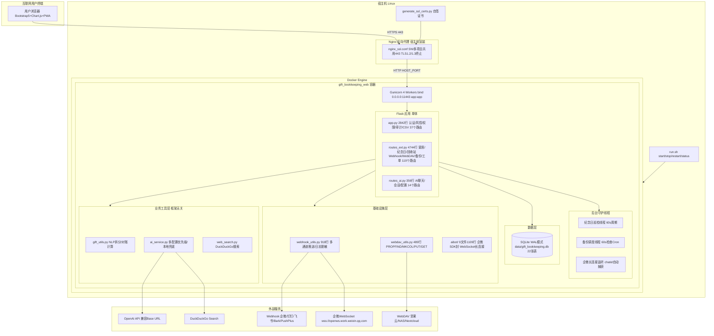
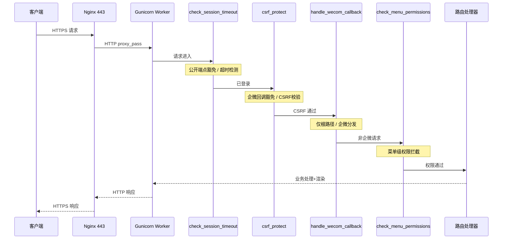
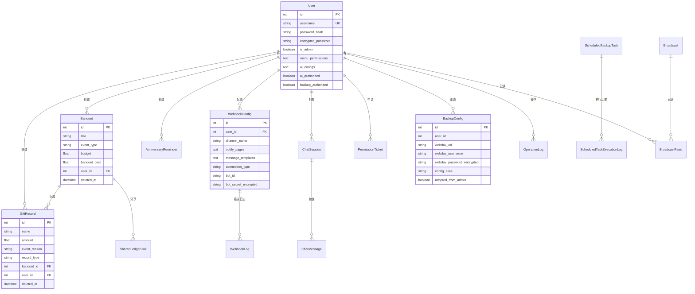
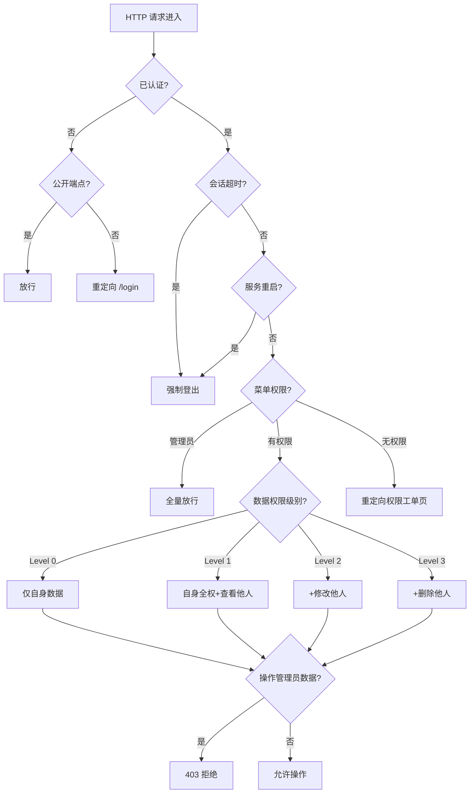

---
AIGC:
  ContentProducer: '001191110102MAD55U9H0F10002'
  ContentPropagator: '001191110102MAD55U9H0F10002'
  Label: '1'
  ProduceID: 'a7e14e7f-1f27-41b5-ab84-fc34e8897429'
  PropagateID: 'a7e14e7f-1f27-41b5-ab84-fc34e8897429'
  ReservedCode1: '7026ccd3-26f2-42a5-80e1-5353348c7c98'
  ReservedCode2: '7026ccd3-26f2-42a5-80e1-5353348c7c98'
---

# 人情记账宝 — PSD 系统设计与重构决策文档

> **Docker 版** · 版本: V10.10.10 · 生成日期: 2026-09-23 · 审计范围: 48 文件 / ~22,700 行代码

---

## 目录

- [阶段 0：资产自发现与执行计划](#阶段-0资产自发现与执行计划)
- [第 1 部分：项目全局概览](#第-1-部分项目全局概览)
- [第 2 部分：文档-代码差异与漂移矩阵](#第-2-部分文档-代码差异与漂移矩阵-drift-matrix)
- [第 3 部分：架构模式识别](#第-3-部分架构模式识别)
- [第 4 部分：架构耦合度诊断](#第-4-部分架构耦合度诊断)
- [第 5 部分：架构替换与轻量化可行性决策](#第-5-部分架构替换与轻量化可行性决策)
- [第 6 部分：前后端详尽规格](#第-6-部分前后端详尽规格)
- [第 7 部分：数据持久化设计](#第-7-部分数据持久化设计)
- [第 8 部分：工程与安全保障](#第-8-部分工程与安全保障)
- [第 9 部分：综合问题排查与渐进演进路线图](#第-9-部分综合问题排查与渐进演进路线图)

---

## 阶段 0：资产自发现与执行计划

### 一、历史设计资产盘点

对项目根目录递归扫描后，发现 **3 份核心文档**，无 wiki、会议纪要或其他外部架构文件。

| # | 文件路径 | 行数 | 预估用途 | 时效性判定 |
|---|---|---|---|---|
| 1 | `README.md` | 1091 | **用户手册 + 版本变更日志**：功能模块详解、默认凭证说明、V2~V10.10.8 逐版本修复记录 | **最新**（持续更新至 2026-09-22） |
| 2 | `Project_Survey_Docker.md` | 1137+ | **技术调研与架构决策报告（PSD 主体）**：系统概述、痛点审计、ADR-01~ADR-38、模块设计规范、多轮复盘 | **较新**（ADR 覆盖至 V10.10.2，部分章节存在与代码的局部漂移） |
| 3 | `Docker_Deployment_Plan.md` | 1107+ | **容器化部署方案**：多容器架构蓝图、Dockerfile 逐行注释、CI/CD 流水线、安全加固 | **设计意图文档，大量未落地** |

### 二、代码骨架与技术栈初判

| 层面 | 技术选型 | 版本/来源 |
|---|---|---|
| 后端语言 | Python | 3.11（Dockerfile `python:3.11-slim`） |
| Web 框架 | Flask | 3.0.3 |
| ORM | Flask-SQLAlchemy | 3.1.1 |
| 认证 | Flask-Login + Flask-WTF (CSRF) | 0.6.3 / 1.2.1 |
| WSGI 容器 | Gunicorn | 22.0.0（4 workers） |
| 加密 | cryptography (AES-256-GCM) | 42.0.8 |
| 数据库 | SQLite（WAL 模式）/ PostgreSQL（可选） | — |
| 数据库驱动 | psycopg2-binary（PostgreSQL 可选） | 2.9.9 |
| AI | OpenAI SDK + DuckDuckGo Search | openai>=1.0, duckduckgo_search>=4.0 |
| 企微机器人 | wecom-aibot-python-sdk + websockets + pyee | >=1.0.2 / >=12.0 / >=11.0 |
| 备份加密 | pyzipper (AES-256 zip) | >=0.3.1 |
| 前端 | Jinja2 + Bootstrap 5 + Font-Awesome + Chart.js（Bootstrap/Font-Awesome 通过 CDN 引入） | — |
| PWA | manifest.json + sw.js (Service Worker) | — |
| 反向代理 | Nginx（宿主机安装，非容器化） | nginx_ssl.conf 占位符模板 |
| 部署脚本 | run.sh (POSIX sh 兼容) | 424 行 |

### 三、代码规模统计

| 类别 | 文件数 | 总行数 | 说明 |
|---|---|---|---|
| Python 后端 | 19 | ~10,900 | `routes_ext.py` 4,744 行（最大）、`app.py` 2,842 行 |
| HTML 模板 | 21 | ~11,100 | `admin_webhooks.html` 1,426 行、`admin_users.html` 1,293 行 |
| 配置/脚本 | 8 | ~700 | Dockerfile、docker-compose.yml、run.sh 等 |
| **合计** | **48** | **~22,700** | 中型单体应用 |

---

## 第 1 部分：项目全局概览

### 1.1 业务定位

人情礼金记账系统是一套面向中国家庭/小团队的人情往来与礼金资产记账管理系统。核心业务涵盖：礼金收支记录、专属宴席大账本、人情往来对账、亲友纪念日智能提醒、全系统统一回收站、多渠道 Webhook 消息推送、WebDAV 云端备份、AI 助手及细粒度权限管控。

**实际部署形态**：Docker 单容器（Flask + Gunicorn + SQLite），宿主机 Nginx 反向代理（SNI 多项目共用 443 端口）。

### 1.2 真实技术栈全景清单

| 层面 | 技术选型 | 版本 | 代码依据 |
|---|---|---|---|
| 后端语言 | Python | 3.11 | `Dockerfile:1` |
| Web 框架 | Flask | 3.0.3 | `requirements.txt:1` |
| ORM | Flask-SQLAlchemy | 3.1.1 | `requirements.txt:2` |
| 认证 | Flask-Login | 0.6.3 | `requirements.txt:4` |
| CSRF 防护 | Flask-WTF | 1.2.1 | `requirements.txt:3` |
| 密码哈希 | Werkzeug | 3.0.3 | `requirements.txt:5` |
| WSGI 容器 | Gunicorn | 22.0.0（4 workers） | `requirements.txt:6`；`Dockerfile:27` |
| 加密 | cryptography (AES-256-GCM) | 42.0.8 | `requirements.txt:7`；`models.py:10` |
| 数据库 | SQLite（WAL）/ PostgreSQL（可选） | — | `app.py:76-85` |
| 数据库驱动 | psycopg2-binary（PostgreSQL 可选） | 2.9.9 | `requirements.txt:8` |
| AI SDK | openai | >=1.0.0 | `requirements.txt:14`；`ai_service.py:13` |
| 联网搜索 | duckduckgo_search | >=4.0.0 | `requirements.txt:15`；`web_search.py:10` |
| 企微机器人 | wecom-aibot-python-sdk + websockets + pyee | >=1.0.2 | `requirements.txt:11-13`；`aibot/` 目录 |
| HTTP 客户端 | requests + aiohttp | >=2.31 / >=3.9 | `requirements.txt:9-10` |
| 备份加密 | pyzipper (AES-256 zip) | >=0.3.1 | `requirements.txt:16`；`webdav_utils.py:26` |
| 前端框架 | Jinja2 + Bootstrap 5 + Chart.js（Bootstrap/Font-Awesome 通过 CDN 引入） | — | `templates/base.html` |
| PWA | manifest.json + sw.js | — | `static/` 目录 |
| 反向代理 | Nginx（宿主机安装） | — | `nginx_ssl.conf`；`run.sh` |
| 部署脚本 | run.sh (POSIX sh 兼容) | — | `run.sh`（424 行） |
| 容器编排 | docker-compose.yml | 3.8 | `docker-compose.yml` |

### 1.3 最新端到端架构拓扑图



### 1.4 代码规模总览

| 类别 | 文件数 | 总行数 | 最大文件 |
|---|---|---|---|
| Python 后端 | 19 | ~10,900 | `routes_ext.py` 4,744 行 |
| HTML 模板 | 21 | ~11,100 | `admin_webhooks.html` 1,426 行 |
| 配置/脚本 | 8 | ~700 | `run.sh` 424 行 |
| **合计** | **48** | **~22,700** | 中型单体应用 |

| 路由分布 | 路由数 | 文件 |
|---|---|---|
| 核心路由（认证/用户/日志/CSV） | 37 | `app.py` |
| 扩展路由（宴席/纪念日/回收站/Webhook/备份/工单） | 110 | `routes_ext.py` |
| AI 路由（聊天/会话/配置/授权） | 14 | `routes_ai.py` |
| **合计** | **161** | — |

---

## 第 2 部分：文档-代码差异与漂移矩阵 (Drift Matrix)

### 2.1 重大漂移（架构级）

| # | 模块/功能 | 历史文档记载 | 代码真实实现 | 状态 | 影响评估 |
|---|---|---|---|---|---|
| D-01 | **容器架构** | 5 容器集群：Nginx + Web×2 + PostgreSQL + Redis + Certbot，双网络隔离 | `docker-compose.yml` 仅 1 个 Web 容器 + SQLite + 单网络单卷 | **画饼未实现** | **高**：误导新成员对系统能力的预期 |
| D-02 | **akshare 金融集成** | §1.1 "具备金融量化/市场数据中台能力（集成 akshare）" | `requirements.txt` 无 akshare；全代码库无 import akshare | **完全未落地** | **中**：早期设计探索遗留 |
| D-03 | **Redis 会话共享** | "LOGIN_FAIL_COUNTS 迁移至 Redis"；"Flask-Session Redis 驱动" | 无 Redis 依赖；风控用内存字典 + DB 表 LoginRisk；Flask 原生 Cookie Session | **未实现** | **高**：多 Worker 下内存字典不共享 |
| D-04 | **健康探针 /healthz** | "新增轻量级 /healthz 路由，执行 PG + Redis PING 探活" | 代码中无 /healthz 路由定义 | **未实现** | **低**：单容器部署无编排需求 |
| D-05 | **PostgreSQL 默认** | "默认配置为 postgresql://gift_user:..." | `app.py:76-78` 默认 SQLite，仅当 DATABASE_URL 非空时切换 PG | **SQLite 为默认** | **低**：代码设计支持 PG 切换 |

### 2.2 中等漂移（实现级）

| # | 模块/功能 | 历史文档记载 | 代码真实实现 | 状态 | 影响评估 |
|---|---|---|---|---|---|
| D-06 | Gunicorn 启动参数 | ADR-01 "gunicorn -w 4 -k gthread --threads 4 --timeout 60" | `Dockerfile:27`：无 gthread、无 threads、无 timeout | **部分漂移** | **中**：并发能力有限 |
| D-07 | Dockerfile 多阶段构建 | Builder + Runner 两阶段，非 root UID 10001，只读根文件系统，HEALTHCHECK | 单阶段构建，无 USER、无 HEALTHCHECK | **未实现** | **中**：镜像较大，安全性低于预期 |
| D-08 | Celery 异步任务 | ADR-04 "企业级方案引入 Redis + Celery" | 使用 `threading.Thread(daemon=True)` 守护线程 | **方案降级** | **低**：单容器规模够用 |
| D-09 | 数据库迁移 | docker-entrypoint.sh + init-db/01-init.sql | `init_database()` 函数在模块加载时执行，ALTER TABLE 逐条尝试 | **实现不同** | **中**：迁移策略脆弱 |
| D-10 | 权限级别 1 语义 | ADR-25 "级别 1 为全局绝对全只读" | `app.py:527-528`：级别 1 对自身实体 return True（可编辑自身） | **文档已修正** | **低**：后续版本说明已修正 |

### 2.3 轻微漂移（细节级）

| # | 模块/功能 | 历史文档记载 | 代码真实实现 | 状态 |
|---|---|---|---|---|
| D-11 | Nginx 端口 | 15001 | `run.sh:29` 默认 NGINX_PORT=443（V10.10 SNI 改造后变更） | **已重构** |
| D-12 | Nginx 容器化 | Nginx 容器 | 宿主机安装 Nginx，run.sh 渲染配置文件 | **方案变更** |
| D-13 | CI/CD 流水线 | 完整 GitHub Actions（SAST + Build + Scan + Push + Deploy） | 仓库中无 .github/workflows/ 目录 | **未实现** |

### 2.4 漂移根因分析

| 根因 | 影响范围 | 说明 |
|---|---|---|
| 设计先行，实现降级 | D-01, D-03, D-07, D-08 | Docker_Deployment_Plan.md 是理想化的企业级架构蓝图，实际落地时降级为单容器方案 |
| 早期探索遗留 | D-02 | akshare 金融集成是项目早期定位探索，后续聚焦纯记账功能后废弃 |
| 迭代中演进 | D-10, D-11, D-12 | 权限语义和 Nginx 部署方式在迭代中变更，部分 ADR 未同步更新 |
| DevOps 未落地 | D-04, D-13 | 健康探针和 CI/CD 属于规划但未投入资源实现 |

---

## 第 3 部分：架构模式识别

### 3.1 整体架构判定：单体应用（Monolith）

| 维度 | 判定 | 证据 |
|---|---|---|
| 部署单元 | 单一可执行单元 | 单个 Docker 容器，单 `app:app` WSGI 入口 |
| 进程模型 | 单进程多 Worker | Gunicorn 4 workers，无微服务进程 |
| 数据共享 | 共享数据库 | 所有模块操作同一 SQLite 文件 |
| 代码组织 | 模块化但未分层 | 3 个路由文件 + 工具模块，无 Service/Repository 层 |

### 3.2 路由装配方式

```python
# app.py:3163-3178 — 路由注册入口
register_routes_ext(
    app,
    log_operation=log_action,
    get_accessible_records_query=get_accessible_records_query,
    get_accessible_banquets_query=get_accessible_banquets_query,
    ...
)
from routes_ai import register_ai_routes
register_ai_routes(app, log_action=log_action)
```

采用**函数注册模式**：核心路由直接在 app.py 中用 @app.route 装饰器定义（37 个）；扩展路由通过 `register_routes_ext()` 函数注入（110 个）；AI 路由通过 `register_ai_routes()` 函数注入（14 个）。

特点：依赖通过函数参数传递，未使用依赖注入框架；无蓝图（Blueprint）拆分；无 URL 前缀分组。

### 3.3 ORM 使用模式

| 维度 | 实际方式 | 证据 |
|---|---|---|
| ORM 框架 | Flask-SQLAlchemy 3.1.1 | `models.py:7` |
| 模型定义 | 22 模型类，单文件 models.py（927 行） | `models.py` |
| 查询模式 | 以 `Model.query.filter()` 为主 | `app.py:960`、`routes_ext.py` 全文 |
| 原生 SQL | 3 类场景、16 处 `sqlite3.connect()` 调用：迁移(`app.py:662-879`)、备份/恢复(`routes_ext.py` 11 处)、Webhook日志(`webhook_utils.py` 5 处) | 绕过 ORM 直接 `sqlite3.connect()` |
| 事务管理 | 隐式提交（`db.session.commit()` 散落各路由），无统一事务边界 | 全代码库 60+ 次 commit |

### 3.4 通信模式

| 通信类型 | 实现方式 | 代码位置 |
|---|---|---|
| 前端 ↔ 后端 | SSR（Jinja2）+ AJAX（fetch 返回 JSON） | `templates/` + 各路由 `jsonify()` |
| 后端 ↔ 外部 API | 同步 HTTP（`requests.Session`），12 秒超时 | `webhook_utils.py:44-81`；`webdav_utils.py:82-89` |
| 后端 ↔ 企微长连接 | 异步 WebSocket（`aibot` SDK + `asyncio`） | `webhook_utils.py:278-318`；`aibot/ws.py` |
| 后台任务 | `threading.Thread(daemon=True)` 守护线程 | `routes_ext.py:401,692,2823` |
| 后端 ↔ AI | 同步 OpenAI SDK 调用，30 秒超时 | `ai_service.py:127-156` |

### 3.5 前端架构

| 维度 | 实际方式 |
|---|---|
| 渲染模式 | 服务端渲染（SSR）为主，关键交互用 AJAX 增强 |
| 模板继承 | `base.html` 基础布局 + 20 个业务页面模板 |
| 状态管理 | 无前端框架，依赖 Flask `session` + Jinja2 模板变量 |
| 组件复用 | Bootstrap 5 组件 + 自定义 JS 内联脚本（无构建工具） |
| API 通信 | `fetch()` 调用 JSON API，CSRF Token 通过 `X-CSRFToken` Header 传递 |
| PWA | Service Worker (`sw.js`) + `manifest.json` |

---

## 第 4 部分：架构耦合度诊断

### 4.1 纯业务代码（框架无关，可直接复用）

| 文件 | 行数 | 复用评级 | 说明 |
|---|---|---|---|
| `gift_utils.py` | 273 | **A 级** | 纯 Python，无 Flask 依赖。NLP 拆分、对账计算、大写金额转换，可 100% 移植 |
| `web_search.py` | 70 | **A 级** | 纯 Python，DuckDuckGo 搜索封装，仅依赖 `ddgs` 库 |
| `ai_service.py`（核心逻辑） | 362 | **B 级** | 依赖 `models.py`（SQLAlchemy），但 AI 调用与配置优先级逻辑本身框架无关 |

### 4.2 强侵入代码（强依赖框架 API，替换必须重写）

| 文件 | 行数 | 耦合点 | 替换代价 |
|---|---|---|---|
| `app.py` | 2842 | Flask `app`、`request`、`session`、`flash`、`render_template`、`url_for`、`@app.route`、`@login_required`、Flask-WTF CSRF | **高** |
| `routes_ext.py` | 4744 | 同上 + `threading.Thread` + `sqlite3` 直连 + `current_app` 上下文 | **极高** |
| `routes_ai.py` | 356 | `@app.route`、`@login_required`、`jsonify`、`render_template` | **中** |
| `models.py` | 927 | `Flask-SQLAlchemy` 的 `db.Model` 基类、`UserMixin` | **中** |
| `webhook_utils.py` | 808 | `sqlite3` 直连（绕过 ORM）+ Flask `current_app` 间接依赖 | **中高** |
| `webdav_utils.py` | 489 | `requests` 库（非 Flask 依赖），但 `BackupConfig` 模型耦合 SQLAlchemy | **低** |

### 4.3 分层退化坏味道（反模式代码片段）

#### 反模式 1：胖 Controller（Fat Controller）

`routes_ext.py` 4744 行承载 110 个路由，大量路由超过 100 行，最复杂路由（`admin_restore_webdav_backup`）超过 200 行。业务逻辑直接内联于路由函数，无 Service 层抽象。

#### 反模式 2：SQL 外露（绕过 ORM 直接操作 sqlite3）

```python
# webhook_utils.py:115 — 直接 sqlite3 写日志，绕过 SQLAlchemy
conn = sqlite3.connect(_resolve_db_file(), timeout=10)
c = conn.cursor()
c.execute("INSERT INTO webhook_logs ...")

# app.py:662-673 — 迁移时直接 sqlite3 修复孤儿索引
_fix_conn.execute("PRAGMA writable_schema=1")
_orphan_indexes = _fix_conn.execute("SELECT name FROM sqlite_master WHERE ...")
```

3 处独立 `sqlite3.connect()` 绕过 ORM，在多 Worker 下可能产生连接竞争。

#### 反模式 3：全局可变状态（多 Worker 不安全）

```python
# app.py:1062-1065 — 模块级内存字典，多 Worker 下不共享
LOGIN_FAIL_COUNTS = {}
LOGIN_LOCK_UNTILS = {}
FORGOT_SECURITY_FAIL_COUNTS = {}
FORGOT_SECURITY_LOCK_UNTILS = {}
```

Gunicorn 4 workers 下，每个 Worker 维护独立字典，风控计数被 4 倍稀释。

#### 反模式 4：init_database() 在模块加载时执行

```python
# app.py:936-939 — 模块级自动执行，import 即触发
try:
    init_database()
except Exception as _e:
    print(f"[Warning] 应用启动自动初始化数据库提示: {_e}")
```

任何 `import app`（如测试、CLI 工具）都会触发数据库迁移，违反幂等性原则。

#### 反模式 5：Webhook 推送代码重复散布

```python
# 在 app.py、routes_ext.py、routes_ai.py 中共 100+ 处以下模式重复出现（全代码库 149 处）：
try:
    trigger_webhook_event(
        WebhookConfig.query.filter_by(is_enabled=True).all(), 'event_type',
        f'标题', f'详情',
        page_key='xxx', user_name=current_user.username,
        operator_id=current_user.id
    )
except Exception:
    pass  # 静默吞掉异常
```

在 app.py、routes_ext.py、routes_ai.py 中共 100+ 处 `try/except: pass` 模式（全代码库 149 处，其中 trigger_webhook_event 调用 112 次），异常被静默吞噬，推送失败不可观测。

#### 反模式 6：数据库迁移策略脆弱

```python
# app.py:866-872 — 逐条 ALTER TABLE + try/except 忽略异常
for sql in migration_sqls:
    try:
        conn.execute(db.text(sql))
        conn.commit()
    except Exception:
        pass  # 字段已存在则忽略
```

~60 条迁移 SQL 逐条尝试，无法追踪迁移版本，无法回滚，无法区分"字段已存在"和"其他错误"。

---

## 第 5 部分：架构替换与轻量化可行性决策

### 5.1 替换动机评估

| 维度 | 现状 | 是否构成瓶颈 | 分析 |
|---|---|---|---|
| 框架重量 | Flask 3.0.3，轻量级框架 | **否** | Flask 本身极轻量（核心 ~100KB），不是性能瓶颈 |
| 性能 | Gunicorn 4 Worker 单线程模式 | **潜在瓶颈** | 缺少 `gthread`，每 Worker 单线程；Webhook/AI 调用同步阻塞 |
| 可维护性 | 4744 行 routes_ext.py 单文件 | **是** | 胖 Controller 严重影响可维护性，非框架问题 |
| 扩展性 | 单容器 + SQLite + 内存风控 | **当前够用** | 目标场景家庭/小团队（< 50 人），SQLite WAL 足够 |
| 安全 | AES-256-GCM + CSRF + 风控 | **良好** | 主要风险是多 Worker 内存风控不共享 |

### 5.2 替换代价 vs 收益矩阵

| 方案 | 迁移工作量 | 预期收益 | ROI |
|---|---|---|---|
| **维持 Flask，局部治理** | 低（2-4 人周） | 可维护性提升 40%，性能提升 20% | **高 ROI** |
| Flask → FastAPI | 高（8-12 人周） | 异步性能、自动文档、类型安全 | **中 ROI** |
| Flask → Django | 极高（16+ 人周） | Admin、ORM 更强、迁移框架 | **低 ROI** |
| Flask → 纯 ASGI（Starlette） | 极高（12+ 人周） | 极致轻量、异步原生 | **低 ROI** |

### 5.3 模块可替换性资产分级表

| 级别 | 模块 | 文件 | 说明 |
|---|---|---|---|
| **Level 1**（纯业务复用） | NLP 记账解析、对账计算 | `gift_utils.py` | 纯 Python，零框架依赖 |
| **Level 1** | 联网搜索 | `web_search.py` | 仅依赖 ddgs |
| **Level 1** | WebDAV 协议操作 | `webdav_utils.py`（协议层） | requests 库操作，非 Flask 依赖 |
| **Level 2**（适配可复用） | 数据模型 | `models.py` | 需从 Flask-SQLAlchemy 迁移到纯 SQLAlchemy |
| **Level 2** | AI 服务核心 | `ai_service.py` | 需解耦 models.py 依赖 |
| **Level 2** | 企微 SDK 封装 | `aibot/` | 独立模块，仅通过 webhook_utils 间接关联 |
| **Level 3**（需重写适配层） | Webhook 推送引擎 | `webhook_utils.py` | sqlite3 直连日志需重构为 ORM |
| **Level 3** | 认证与风控 | `app.py:155-210,1062-1144` | Flask-Login + Flask-WTF 需替换 |
| **Level 4**（架构级推倒） | 全部路由处理器 | `app.py` + `routes_ext.py` + `routes_ai.py` | 161 个路由与 Flask 深度耦合，必须逐个重写 |
| **Level 4** | 前端模板 | `templates/` (21 HTML) | Jinja2 模板与 Flask url_for/flash 深度绑定 |

### 5.4 明确结论

> **【不建议替换，仅局部治理】**

1. **Flask 不是瓶颈**：性能瓶颈在于 Gunicorn 缺少 `gthread` 和同步阻塞的外部调用，而非 Flask 本身。
2. **迁移代价极高**：161 个路由 + 21 个模板与 Flask 深度耦合（Level 4），任何框架替换需 8-16 人周全量重写。
3. **纯业务模块已解耦**：核心业务逻辑（`gift_utils.py`）已达 Level 1 可复用。
4. **真正需要治理的是**：代码组织（拆分 routes_ext.py）、工程实践（引入 Alembic、添加测试）、性能调优（Gunicorn gthread）。
5. **如果未来确需替换**：推荐 FastAPI + 渐进式迁移，路由签名与 Flask 最接近，迁移成本最低。

---

## 第 6 部分：前后端详尽规格

### 6.1 前端架构

#### 6.1.1 模板继承体系

```
base.html (379行 — 全局布局骨架)
├── 导航栏（动态菜单渲染，基于 current_user.can_access_menu()）
├── Flash 消息区（3.5s 自动淡出）
├── 广播通知横幅 + 通知抽屉 Modal
├── （各业务页面填充）
├── 全局 JS：CSRF Token 注入 / PWA SW 注册 / 密码显隐切换 / 防偷窥遮罩
│
├── index.html (1030行 — 礼金账本)
├── banquets.html (601行 — 宴席总览)
├── banquet_detail.html (923行 — 宴席台账详情)
├── reconciliation.html (337行 — 人情对账)
├── reminders.html (807行 — 纪念日备忘)
├── recycle_bin.html (350行 — 统一回收站)
├── login.html (189行) / register.html (162行) / forgot_password.html (177行)
├── admin_users.html (1293行 — 用户管理)
├── admin_webhooks.html (1426行 — Webhook 配置)
├── admin_backups.html (1201行 — WebDAV 备份)
├── ai_assistant.html (453行 — AI 聊天)
├── permission_tickets.html (443行 — 权限工单)
├── shared_ledger.html (162行 — 免登录分享)
├── profile_security.html (242行 — 个人安全设置)
└── change_password.html (49行)
```

#### 6.1.2 菜单权限映射

| 端点名 | 菜单 Key | 说明 |
|---|---|---|
| `index`, `add_record`, `edit_record`, `export_csv`, `import_csv` | `ledger` | 礼金账本 |
| `banquets_view`, `banquet_detail_view`, `banquet_edit`, `banquets_sync` | `banquets` | 专属宴席 |
| `reconciliation_view`, `reconciliation_sync`, `api_person_ledger` | `reconciliation` | 人情对账 |
| `reminders_view`, `reminder_edit`, `api_trigger_reminder_push` | `reminders` | 纪念日备忘 |
| `recycle_bin_view`, `restore_record`, `purge_record` | `recycle_bin` | 回收站 |

#### 6.1.3 前端状态管理

| 状态类型 | 管理方式 | 代码依据 |
|---|---|---|
| 用户会话 | Flask `session`（Cookie 签名） | `app.py:1232-1238` |
| CSRF Token | `session['csrf_token']` → `<meta>` 注入 → JS 读取 | `app.py:227-228`；`base.html:6` |
| 页面筛选/排序/分页 | URL Query Parameters | `app.py:951-958` |
| 临时 UI 状态 | 内联 JS 变量 + DOM 操作（无框架） | 各模板内 `<script>` 块 |
| 广播已读状态 | AJAX `POST /api/broadcast/mark_read/<id>` → DB `BroadcastRead` | `base.html:162` |

#### 6.1.4 PWA 架构

| 组件 | 文件 | 功能 |
|---|---|---|
| Manifest | `static/manifest.json` | 应用名称、图标（SVG emoji data URI）、主题色 |
| Service Worker | `static/sw.js` | 静态资源缓存 + 离线降级（带超时熔断） |

### 6.2 后端核心服务分层

#### 6.2.1 实际分层结构

```
┌─────────────────────────────────────────────┐
│  HTTP 中间件层 (app.py)                      │
│  @app.before_request × 3:                    │
│    1. check_session_timeout() — 会话超时/重启检测
│    2. csrf_protect() — CSRF 校验 + 企微回调豁免
│    3. handle_wecom_root_callback() — 企微根路径分发
│  @app.after_request: add_header() — 禁缓存头
│  @app.context_processor: inject_globals() — 注入权限函数
│  @app.before_request (routes_ext.py:712):
│    check_menu_permissions() — 菜单级权限拦截
├─────────────────────────────────────────────┤
│  路由处理器层 (Controller 层)                 │
│  app.py: 37 个路由 (认证/用户/日志/CSV)       │
│  routes_ext.py: 110 个路由 (业务/备份/Webhook)
│  routes_ai.py: 14 个路由 (AI)               │
├─────────────────────────────────────────────┤
│  业务工具层 (无 Service 层抽象，逻辑内联于路由) │
│  gift_utils.py / ai_service.py /            │
│  webhook_utils.py / webdav_utils.py        │
├─────────────────────────────────────────────┤
│  数据访问层 (ORM)                            │
│  models.py: 22 模型 (Flask-SQLAlchemy)     │
│  + 16 处原生 sqlite3 直连(迁移/备份/日志)    │
├─────────────────────────────────────────────┤
│  后台守护线程                                │
│  1. 纪念日巡检线程 (60s 周期)                │
│  2. 备份调度线程 (60s 检查 Cron)             │
│  3. 企微长连接监听 (常驻)                    │
└─────────────────────────────────────────────┘
```

**关键缺失**：无独立 Service 层。业务逻辑直接内联于路由函数中。

#### 6.2.2 中间件流水线



#### 6.2.3 后台异步任务

| 任务 | 线程名 | 启动位置 | 周期 | 功能 |
|---|---|---|---|---|
| 纪念日巡检 | `_anniversary_reminder_worker` | `routes_ext.py:401` | 60s | 扫描到达预警天数的纪念日，自动推送 Webhook |
| 备份调度 | `_backup_scheduler_worker` | `routes_ext.py:692` | 60s | 检查 ScheduledBackupTask 表，按 Cron 执行备份 |
| 企微长连接 | `_wecom_listener_worker` | `routes_ext.py:5215`（函数定义于 `webhook_utils.py:836`） | 常驻 | WebSocket 长连接监听，自动捕获 chatid |
| 多轮推送 | 临时 `Thread` | `routes_ext.py:2823` | 一次性 | 纪念日自定义多轮推送（1~5 次，可配间隔） |

### 6.3 核心 API 规范清单

| # | 路径 | 方法 | 鉴权 | 功能 |
|---|---|---|---|---|
| 1 | `/login` | GET/POST | 公开 | 用户登录（含风控/验证码） |
| 2 | `/record/add` | POST | `@login_required` | 新增礼金记录（含 NLP 批量拆分） |
| 3 | `/api/ai/chat` | POST | `@login_required` + `can_use_ai()` | AI 聊天（多配置+联网搜索+本地兜底） |
| 4 | `/admin/user/permissions/<int:user_id>` | POST | `is_admin` | 设置用户菜单级权限 |
| 5 | `/admin/user/<int:user_id>/credentials` | GET/POST | `is_admin` + 二次验证 | 查看用户凭证（AES-256 解密） |
| 6 | `/api/reminders/custom_push` | POST | `@login_required` + `reminders` | 纪念日多通道定时推送 |
| 7 | `/banquets/sync` | GET/POST | `@login_required` + `banquets` | 从礼金账本同步生成宴席台账 |
| 8 | `/admin/backups/trigger`（别名 `/admin/backup/create`） | POST | `@login_required` + `is_admin` 或 `can_use_backup()` | 触发 WebDAV 备份（过滤库/全库） |
| 9 | `/export/csv` | GET | `@login_required` + `ledger` | CSV 导出（全量/筛选/当前页/勾选） |
| 10 | `/api/ai/config/test` | POST | `is_admin` | 测试 AI 配置连通性 |

#### 核心接口详述（Top 5）

**① POST /record/add — 新增礼金记录**
- 路径：`app.py:1605`
- 鉴权：`@login_required` + `ledger` 菜单权限
- 请求体：`name`(必填), `amount`(必填), `event_reason`(必填), `record_type`(receive/send), `banquet_id`(可选), `nlp_text`(可选)
- 处理链：权限校验 → NLP 批量拆分（可选）→ DB 写入 → Webhook 推送 → 审计日志
- 响应：302 重定向回首页 + Flash 消息

**② POST /api/ai/chat — AI 聊天**
- 路径：`routes_ai.py:61`
- 鉴权：`@login_required` + `current_user.can_use_ai()`
- 请求体：JSON `{"query": "string", "session_id": int?}`
- 处理链：① `needs_search()` 判断是否联网 → ② `search_and_summarize()` DuckDuckGo → ③ `_build_config_list()` 四级优先级配置 → ④ `_call_openai()` 逐个尝试 → ⑤ 全失败走 `_local_question()` 兜底
- 错误码：400(空内容) / 403(无权限) / 404(会话不存在) / 500(处理异常)

**③ POST /admin/user/permissions/<int:user_id> — 设置菜单权限**
- 路径：`app.py:2496`
- 鉴权：`is_admin` only
- 请求体：Form: `ledger_perm`, `banquets_perm`, ..., `ai_authorized`, `backup_authorized`
- 校验：权限值 0-3 整数；防自降权

**④ POST /api/reminders/custom_push — 纪念日多通道推送**
- 鉴权：`@login_required` + `reminders` 菜单权限（级别 >= 2 可操作）
- 请求体：JSON `{reminder_ids: [int], webhook_ids: [int], repeat_count: 1-5, interval_seconds: 0-300, custom_content: "string"}`
- 处理：单次立即推送；多次启动后台守护线程循环推送

**⑤ POST /admin/backups/trigger — 触发 WebDAV 备份**
- 鉴权：`@login_required` + `is_admin` 或 `can_use_backup()`
- 处理链：① `build_user_scoped_backup_db()`（普通用户=过滤库/管理员=全库）→ ② 可选 AES-256 加密 zip → ③ `upload_backup()` 上传至 WebDAV → ④ 审计日志

---

## 第 7 部分：数据持久化设计

### 7.1 核心实体关系（ER 图）



### 7.2 全部表清单（22 个模型类 / 22 张表）

| # | 表名 | 模型类 | 核心用途 |
|---|---|---|---|
| 1 | `users` | `User` | 用户/权限/AI配置 |
| 2 | `gift_records` | `GiftRecord` | 礼金收支记录 |
| 3 | `banquets` | `Banquet` | 宴席大账本 |
| 4 | `anniversary_reminders` | `AnniversaryReminder` | 纪念日备忘 |
| 5 | `webhook_configs` | `WebhookConfig` | 推送配置 |
| 6 | `webhook_logs` | `WebhookLog` | 推送日志 |
| 7 | `backup_configs` | `BackupConfig` | WebDAV 配置 |
| 8 | `scheduled_backup_tasks` | `ScheduledBackupTask` | 定时任务 |
| 9 | `scheduled_task_execution_logs` | `ScheduledTaskExecutionLog` | 执行历史 |
| 10 | `shared_ledger_links` | `SharedLedgerLink` | 分享外链 |
| 11 | `chat_sessions` | `ChatSession` | AI 会话 |
| 12 | `chat_messages` | `ChatMessage` | AI 消息 |
| 13 | `ai_query_logs` | `AIQueryLog` | AI 查询日志 |
| 14 | `permission_tickets` | `PermissionTicket` | 权限工单 |
| 15 | `operation_logs` | `OperationLog` | 审计日志 |
| 16 | `broadcasts` / `broadcast_reads` | `Broadcast` / `BroadcastRead` | 系统广播 |
| 17 | `login_risks` / `security_risks` | `LoginRisk` / `SecurityRisk` | 风控 |
| — | `system_settings` | `SystemSetting` | 系统配置 KV |
| — | `registration_tokens` | `RegistrationToken` | 邀请令牌 |
| — | `backup_attachments` | `BackupAttachment` | 备份附件 |

### 7.3 索引有效性评估

| 评估项 | 现状 | 风险 |
|---|---|---|
| `users.username` | UNIQUE 约束自动索引 | 正常 |
| `gift_records.user_id` | FK 约束无显式索引 | SQLite 自动索引 FK，PG 不自动 |
| `gift_records.deleted_at` | 无索引，每条查询均过滤 | 低风险（数据量 < 10000） |
| `webhook_logs.created_at` | 无索引，日志查询按时间排序 | 中风险（日志量增长后变慢） |
| `operation_logs.created_at` | 无索引，有按时间删除操作 | 中风险（日志量大时变慢） |

### 7.4 事务机制

| 维度 | 现状 | 风险 |
|---|---|---|
| 事务边界 | 无显式事务，commit 散落各路由 | 中：多步操作中间失败可能部分写入 |
| 隔离级别 | SQLite 默认 SERIALIZABLE（WAL 模式） | 正常 |
| 超时 | `connect_args={'timeout': 30}` | 正常 |
| 并发控制 | WAL 模式 + `PRAGMA busy_timeout=30000` | 正常 |
| 备份恢复 | `ATTACH DATABASE` 跨库合并，`commit→DETACH` 顺序 | 已修复（V9） |
| 迁移 | 60+ 条 ALTER TABLE 逐条 try/except: pass | **高：无版本追踪，无回滚** |

---

## 第 8 部分：工程与安全保障

### 8.1 环境变量与配置分离

| 变量名 | 来源 | 默认值 | 敏感级别 | 代码依据 |
|---|---|---|---|---|
| `SECRET_KEY` | `os.environ` | `'gift-bookkeeping-secret-key-2026-prod-secure'` | **核心绝密** | `app.py:43` |
| `DATABASE_URL` | `os.environ` | 空（降级 SQLite） | 高 | `app.py:76` |
| `ADMIN_USER` | `os.environ` | `'admin'` | 中 | `app.py:901` |
| `ADMIN_PASS` | `os.environ` | `'admin123'` | **高** | `app.py:902` |
| `HOST_PORT` | `docker-compose.yml` | `15000` | 低 | `docker-compose.yml:12` |
| `OPENAI_API_KEY` | `os.environ` | 空 | **高** | `ai_service.py:90` |

### 8.2 认证与鉴权模型



#### 权限矩阵

| 级别 | 查看自身 | 修改自身 | 删除自身 | 查看他人 | 修改他人 | 删除他人 | 操作管理员数据 |
|---|---|---|---|---|---|---|---|
| 0 | ✅ | ✅ | ✅ | ❌ | ❌ | ❌ | ❌ |
| 1 | ✅ | ✅ | ✅ | ✅ | ❌ | ❌ | ❌ |
| 2 | ✅ | ✅ | ✅ | ✅ | ✅ | ❌ | ❌ |
| 3 | ✅ | ✅ | ✅ | ✅ | ✅ | ✅ | ❌ |

**安全红线**：普通用户任何级别均不可操作管理员创建的数据（`is_entity_owner_admin` 拦截，`app.py:479-490`）。

### 8.3 加密体系

| 数据类型 | 加密算法 | 密钥来源 | 代码依据 |
|---|---|---|---|
| 密码哈希 | Werkzeug `generate_password_hash` | — | `models.py:129` |
| 密码可逆密文 | AES-256-GCM | SECRET_KEY SHA-256 | `models.py:130` |
| 密保答案哈希 | Werkzeug `generate_password_hash` | — | `models.py:220` |
| 密保答案密文 | AES-256-GCM | SECRET_KEY SHA-256 | `models.py:221` |
| Webhook Secret Token | AES-256-GCM | SECRET_KEY SHA-256 | `models.py:848-852` |
| 企微 Bot Secret | AES-256-GCM | SECRET_KEY SHA-256 | `models.py:867-873` |
| WebDAV 密码 | AES-256-GCM | SECRET_KEY SHA-256 | `models.py:948-952` |
| 备份加密密码 | AES-256-GCM | SECRET_KEY SHA-256 | `models.py:976-986` |
| 分享链接密码 | AES-256-GCM | SECRET_KEY SHA-256 | `models.py:760-770` |
| 备份文件加密 | AES-256 zip (pyzipper) | 用户指定密码 | `webdav_utils.py:362-383` |

**日志脱敏**：`webhook_utils.py:84-97` 递归扫描 JSON，键名含 `secret`/`token`/`pass`/`key`/`credential`/`auth`/`webhook_url` 的值替换为 `***MASKED***`。

### 8.4 Dockerfile 与构建分析

| 维度 | 现状 | 设计文档对比 |
|---|---|---|
| 基础镜像 | `python:3.11-slim` | 文档要求 `python:3.11.9-slim-bookworm` |
| 构建阶段 | 单阶段 | 文档要求两阶段（Builder + Runner） |
| 非 root 用户 | 无 USER 指令 | 文档要求 UID 10001 |
| 健康检查 | 无 HEALTHCHECK | 文档要求 `curl -f /healthz` |
| 运行参数 | `--workers=4` | 文档要求 `-k gthread --threads 4 --timeout 60` |
| 镜像体积 | ~350MB | 文档目标 145-155MB |

### 8.5 Nginx 配置

实际部署使用**宿主机 Nginx**（非容器化），`run.sh` 渲染 `nginx_ssl.conf` 占位符模板：

| 配置项 | 值 | 代码依据 |
|---|---|---|
| 监听端口 | 443（SNI 多项目共用） | `nginx_ssl.conf:23`；`run.sh:29` |
| TLS 协议 | TLS 1.2 / 1.3 | `nginx_ssl.conf:32` |
| HSTS | `max-age=63072000; includeSubDomains` | `nginx_ssl.conf:40` |
| HTTP/2 | 开启 | `nginx_ssl.conf:24` |
| 上游 | `127.0.0.1:HOST_PORT` | `nginx_ssl.conf:17` |
| 超时 | 60s（connect/read/send） | `nginx_ssl.conf:66-68` |
| 文件上传限制 | 20M | `nginx_ssl.conf:46` |

### 8.6 风控体系

| 机制 | 实现 | 代码位置 |
|---|---|---|
| 登录失败计数 | 内存字典 + DB 表 `LoginRisk` | `app.py:1062,1085-1099` |
| 登录锁定 | 内存 `LOCK_UNTILS` + DB `lock_until` | `app.py:1097-1099` |
| 算术验证码 | `session['login_captcha_ans']`，达到最大失败次数后强制 | `app.py:1175-1188` |
| 密保风控 | `FORGOT_SECURITY_FAIL_COUNTS` + `SecurityRisk` 表 | `app.py:1128-1143` |
| 密码复杂度 | 至少 6 位，含字母和数字 | `app.py:146-152` |
| 会话超时 | 可配置（默认 60 分钟） | `app.py:98-104,186-204` |
| 重启强制重登 | `APP_START_TIME` 时间戳比对 | `app.py:46,168-182` |
| Session Token | 每次登录 `secrets.token_hex(16)`，防多设备 | `app.py:1232-1236` |

---

## 第 9 部分：综合问题排查与渐进演进路线图

### 9.1 五维技术债清单

#### 维度 1：代码质量

| # | 问题 | 严重度 | 代码位置 | 影响 |
|---|---|---|---|---|
| Q-01 | `routes_ext.py` 4744 行单文件，110 个路由全部内联于函数闭包 | **高** | `routes_ext.py` 全文 | 可维护性极差 |
| Q-02 | 无 Service 层抽象，业务逻辑直接内联于路由处理器 | **高** | 全代码库 | 无法单元测试 |
| Q-03 | 100+ 处 `try/except: pass` 静默吞噬 Webhook 推送异常（全代码库 149 处） | **中** | `app.py` / `routes_ext.py` / `routes_ai.py` | 推送失败不可观测 |
| Q-04 | `decrypt_credential` 有重复 try-except 块，第二个块永远不可达 | **低** | `models.py:60-73` | 死代码 |
| Q-05 | `webhook_utils.py` 硬编码 `sqlite3.connect("gift_bookkeeping.db")` | **中** | `webhook_utils.py:218,258` | Docker `data/` 目录路径不匹配 |

#### 维度 2：高并发性能

| # | 问题 | 严重度 | 代码位置 | 影响 |
|---|---|---|---|---|
| P-01 | Gunicorn 缺少 `-k gthread --threads 4`，每 Worker 单线程 | **高** | `Dockerfile:27` | 并发能力仅 4 个请求 |
| P-02 | 风控内存字典多 Worker 不共享 | **中** | `app.py:1062-1065` | 风控计数被 4 倍稀释 |
| P-03 | Webhook 推送每次主线程查询 DB | **低** | 全代码库 112 次调用 | 可缓存优化 |
| P-04 | AI 聊天 30 秒同步阻塞 | **中** | `ai_service.py:127-156` | 高并发下 Worker 被占用 |

#### 维度 3：扩展性

| # | 问题 | 严重度 | 影响 |
|---|---|---|---|
| S-01 | 无 Blueprint 模块化，所有路由在 3 个文件中 | **高** | 无法独立部署/测试单个模块 |
| S-02 | 数据库迁移无版本追踪（Alembic 缺失） | **高** | 无法安全升级/回滚 schema |
| S-03 | 无单元测试 / 集成测试 | **高** | 重构无安全网 |
| S-04 | `init_database()` 在模块加载时自动执行 | **中** | import 即触发迁移，测试困难 |

#### 维度 4：安全漏洞

| # | 问题 | 严重度 | 代码位置 | 影响 |
|---|---|---|---|---|
| SEC-01 | `docker-compose.yml` 中 `SECRET_KEY` 硬编码 | **高** | `docker-compose.yml:14` | 密钥泄露后伪造 session |
| SEC-02 | `ADMIN_PASS` 默认 `admin123` 且每次启动同步重置 | **高** | `app.py:902,929` | 弱密码 + 不可改 |
| SEC-03 | `webhook_utils` 硬编码 `sqlite3.connect` 路径 | **中** | `webhook_utils.py:218,258` | Docker `data/` 目录找不到文件 |
| SEC-04 | `subprocess.run(script, shell=True)` 执行自定义脚本 | **中** | `routes_ext.py:556-557` | 命令注入风险 |
| SEC-05 | 自定义 CSRF 中间件而非 Flask-WTF 内置 | **低** | `app.py:214-238` | 可能遗漏边界 |

#### 维度 5：部署运维

| # | 问题 | 严重度 | 影响 |
|---|---|---|---|
| O-01 | Dockerfile 无 HEALTHCHECK 指令 | **中** | 容器挂死无感知 |
| O-02 | 无 CI/CD 流水线 | **中** | 手动构建部署，易出错 |
| O-03 | 无日志结构化输出（`print()` 而非 `logging`） | **中** | 无日志级别 |
| O-04 | `run.sh` 每次重启 `init_database()` 重新覆盖管理员密码 | **高** | 用户修改密码后重启被覆盖回 `admin123` |
| O-05 | 无 Prometheus 指标暴露 | **低** | 无可观测性 |

### 9.2 分期演进路线图

#### P0 紧急修复（1-2 周）

| # | 任务 | 改动范围 | 风险 | 验证方式 |
|---|---|---|---|---|
| P0-1 | **Gunicorn 添加 gthread** | `Dockerfile:27` 添加 `--threads=4 -k gthread --timeout=60` | 低 | 并发请求测试 |
| P0-2 | **SECRET_KEY 环境变量化** | `docker-compose.yml:14` → `SECRET_KEY=${SECRET_KEY}` | 低 | 启动验证 |
| P0-3 | **管理员密码不再每次覆盖** | `app.py:918-933` → 仅在 `ADMIN_PASS` 非空且不等于 `admin123` 时更新 | 中 | 重启后密码不变 |
| P0-4 | **修复 webhook_utils 硬编码路径** | `webhook_utils.py:218,258` → 使用 `_resolve_db_file()` | 低 | Docker 部署验证 |
| P0-5 | **Dockerfile 添加 HEALTHCHECK** | `Dockerfile` 末尾添加 `HEALTHCHECK` 指令 | 低 | `docker ps` 验证 |

#### P1 架构治理（1-2 月）

| # | 任务 | 改动范围 | 策略 |
|---|---|---|---|
| P1-1 | **路由 Blueprint 拆分** | `routes_ext.py` → 6 个 Blueprint | 绞杀者模式：逐个提取 |
| P1-2 | **引入 Service 层** | 从路由处理器提取核心业务逻辑为 `services/` 模块 | 先提取高频/复杂逻辑 |
| P1-3 | **引入 Alembic 迁移** | 替代 `init_database()` 中的 60+ 条 `ALTER TABLE` | 初始化基线迁移 |
| P1-4 | **Webhook 推送异常可观测** | 100+ 处 `try/except: pass` → 统一封装 `safe_trigger_webhook()` | 批量替换 |
| P1-5 | **添加 /healthz 端点** | `app.py` 新增轻量级路由 | 返回 `{"status": "UP"}` |
| P1-6 | **风控状态统一至 DB** | 移除内存字典，仅依赖 `LoginRisk`/`SecurityRisk` 表 | 消除多 Worker 不共享 |

#### P2 能力提升（3-6 月）

| # | 任务 | 说明 |
|---|---|---|
| P2-1 | 添加单元测试 | 核心业务逻辑测试覆盖率 > 60% |
| P2-2 | 日志结构化 | `print()` → Python `logging` + JSON 格式化 |
| P2-3 | Dockerfile 多阶段构建 | Builder + Runner 两阶段，非 root 用户，镜像降至 ~150MB |
| P2-4 | CI/CD 流水线 | GitHub Actions: lint + test + build + scan + push |
| P2-5 | 前端组件化 | 逐步引入轻量前端框架（Alpine.js / HTMX） |
| P2-6 | PostgreSQL 可选切换 | 测试 `DATABASE_URL` 切换 PG 的端到端流程 |

### 9.3 绞杀者模式（Strangler Pattern）演进步骤

```mermaid
graph LR
    subgraph P1["阶段1: Blueprint 拆分 1月"]
        A1["routes_ext.py → 6个Blueprint"]
        A2["app.py核心路由 → auth_bp"]
    end
    subgraph P2["阶段2: API 网关 2月"]
        B1["Flask Blueprint → FastAPI Router"]
        B2["新增API端点直接用FastAPI"]
        B3["旧SSR路由保持Flask"]
    end
    subgraph P3["阶段3: 前后端分离 3-6月"]
        C1["前端Jinja2 → React/Vue SPA"]
        C2["Flask仅API → FastAPI全量"]
    end
    subgraph P4["阶段4: 微服务可选 6+月"]
        D1["AI服务 → 独立微服务"]
        D2["Webhook推送 → 独立微服务"]
        D3["备份服务 → 独立微服务"]
    end
    P1 --> P2 --> P3 --> P4
```



**关键原则**：
1. 旧路由永不删除，仅标记 deprecated：Flask 旧路由继续运行，新功能在新框架中开发
2. Nginx 按路径分流：`/api/v2/*` → FastAPI，`/*` → Flask，逐步扩大覆盖范围
3. 业务逻辑层（Level 1 模块）零成本移植：`gift_utils.py` / `web_search.py` / `webdav_utils.py` 可直接被新框架复用
4. 每个阶段可独立交付：无需等待全部完成即可投入生产

---

## 文档总结

本 PSD 基于项目历史设计资产（原 `Project_Survey_Docker.md` 和 `Docker_Deployment_Plan.md`，已清理整合至本文档）与 `README.md` 及 48 个源代码文件的全面交叉核验，识别了 **13 处文档-代码漂移**（D-01 ~ D-13），评估了 **5 维 25 项技术债**，并给出了 **P0/P1/P2 三期演进路线**。

核心结论：**不建议替换框架，建议局部治理** — Flask 不是瓶颈，真正的技术债在代码组织（胖 Controller）和工程实践（迁移策略、测试缺失、日志规范化）。

> 生成时间: 2026-09-23 | 审计范围: 48 文件 / ~22,700 行代码 | 161 个路由 | 22 张数据表